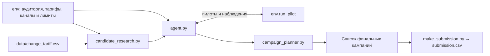

# Агент управления тарифными маркетинговыми кампаниями

Решение для кейса Beeline на HackAlem: Python-агент помогает маркетинговому аналитику составить план предложений по смене тарифа. Он выбирает аудиторию, целевой тариф и канал связи, проверяет гипотезы небольшими пилотами и распределяет оставшиеся ресурсы между финальными кампаниями.

**Все данные и результаты синтетические. Они не описывают реальных клиентов или финансовые показатели Beeline.**

Финальная версия находится в [challenges/beeline-tariff-campaigns/](challenges/beeline-tariff-campaigns/README.md). Основные артефакты — `agent.py` и воспроизводимый `submission.csv`. Для работы агента также нужны модули `candidate_research.py` и `campaign_planner.py`.

## Задача и пользователь

Пользователь — аналитик маркетинга, планирующий тарифные кампании на следующий месяц. Предложение сменить тариф может повысить выручку, не дать эффекта или привести к менее выгодному переходу. При ограниченном бюджете важно проверить гипотезы до масштабирования кампаний.

История относится к другой выборке абонентов. Агент использует её для начальной оценки, а затем уточняет эффект по пилотам на текущей аудитории. Цель — увеличить чистый прирост ARPU, то есть средней выручки на абонента, с учётом стоимости коммуникаций:

```text
Чистый результат = прирост ARPU по уникальным абонентам − стоимость контактов
```

В результат входят пилоты и финальные кампании. Повторные контакты не умножают эффект: оценщик учитывает для каждого абонента лучшую кампанию, а стоимость контактов сохраняется.

## Что реализовано

- Гипотезы по текущему тарифу и ARPU-сегменту: до трёх целевых тарифов на каждую группу аудитории.
- Слабые исторические оценки эффекта с удалением точных дубликатов и снижением доверия к редким переходам.
- Последовательный выбор пилотов с учётом ожидаемой пользы новых наблюдений и уменьшения неопределённости.
- Обновление оценок по фактической обратной связи `env.run_pilot(...)`.
- Выбор каналов `push`, `sms`, `digital_ads` и `call` с учётом эффекта, стоимости и ресурсов.
- Планирование до десяти финальных кампаний с учётом пересечения аудиторий.
- Резервная логика при ошибках обработки пилотов или планирования, сохраняющая пользу уже проведённых пилотов.
- Генерация `submission.csv`, проверки ограничений, воспроизводимости и обработки ошибок.

На предоставленных данных формируется 189 гипотез для 63 групп аудитории. Это результат обработки входных таблиц, а не список тарифов или клиентов, зашитый в агент.

## Как работает решение

1. **Получение среды.** Оценщик вызывает `Agent().act(env)`. Среда предоставляет аудиторию, тарифы, параметры каналов, остатки ресурсов и метод запуска пилотов.
2. **Подготовка гипотез.** `candidate_research.py` группирует аудиторию по текущему тарифу и ARPU-сегменту. История `data/change_tariff.csv` задаёт начальные оценки. Если история недоступна, используются нейтральные гипотезы для ближайших более дорогих тарифов.
3. **Пилоты.** Агент последовательно выбирает гипотезы для проверки. Обычно используется SMS и до 200 клиентов на пилот. После каждого наблюдения обновляются средняя оценка эффекта и её неопределённость. Выбор учитывает как поиск лучшего предложения, так и дополнительную проверку перспективного варианта.
4. **Планирование.** Для всех каналов, включая бесплатный push, применяется осторожная оценка: `средний эффект − 0,5 × стандартное отклонение`. Планировщик последовательно выбирает кампании с наибольшим ожидаемым дополнительным чистым эффектом, проверяя оставшиеся ресурсы.
5. **Результат.** `act(env)` возвращает список словарей с аудиториями, тарифами и каналами. Скрипт `make_submission.py` запускает агента с фиксированным seed 42 и сохраняет план в CSV.

При сбое планировщика агент использует резервный план. Если все оценки отрицательны, резервная логика ищет небольшую допустимую аудиторию с наименьшей оценкой потерь, чтобы выполнить требование вернуть хотя бы одну кампанию.

## Архитектура



Пути в таблице указаны относительно `challenges/beeline-tariff-campaigns/`.

| Компонент | Назначение |
|---|---|
| `agent.py` | Точка входа, цикл пилотов и обработка сбоев |
| `candidate_research.py` | Группы аудитории и исторические гипотезы |
| `campaign_planner.py` | Байесовское обновление оценок, выбор пилотов и распределение ресурсов |
| `submission.csv` | Воспроизводимый результат для сдачи |
| `requirements.txt` | Зависимости Python |
| `tests/` | Проверки интерфейса, лимитов, воспроизводимости и резервной логики; отдельные тесты исследовательских моделей |
| `environment.py`, `mock_environment.py` | Среда организатора и её локальная имитация |
| `scoring_core.py`, `local_eval.py`, `make_submission.py` | Организаторские инструменты оценки и подготовки результата |
| `data/`, `customer_profile.csv` | Исходные данные в предусмотренных организатором путях |
| `experiments/` | Исследовательские скрипты, альтернативные агенты, результаты и производные таблицы |

Финальный агент не импортирует код и не читает результаты из `experiments/`. Исходные данные и скрипты организатора сохранены без изменений.

## Технологии и интеграции

Используются Python, `numpy>=1.24` и `pandas>=2.0`; тесты написаны на стандартном `unittest`. В конфигурации GitHub Actions указан Python 3.11.

Оценки эффекта обновляются байесовским методом, а финальные кампании выбираются жадным алгоритмом. В финальной версии нет LLM, внешних API, базы данных или отдельных файлов обученной модели. Ключи доступа и сетевые подключения для работы агента не требуются после установки зависимостей. Рабочая интеграция — публичный интерфейс среды организатора.

## Установка и запуск

Команды выполняются из корня клонированного репозитория. Можно использовать Python 3.11, указанный в CI проекта.

### Windows PowerShell

```powershell
cd challenges\beeline-tariff-campaigns
python -m venv .venv
.\.venv\Scripts\python.exe -m pip install -r requirements.txt
.\.venv\Scripts\python.exe local_eval.py
.\.venv\Scripts\python.exe local_eval.py --runs 10
.\.venv\Scripts\python.exe make_submission.py
.\.venv\Scripts\python.exe -m unittest discover -s tests -v
```

Здесь интерпретатор окружения вызывается напрямую, поэтому активация PowerShell-скриптом не нужна. Если окружение уже создано и зависимости установлены, шаги подготовки можно пропустить.

### Linux / macOS

```bash
cd challenges/beeline-tariff-campaigns
python3 -m venv .venv
source .venv/bin/activate
python -m pip install -r requirements.txt
python local_eval.py
python local_eval.py --runs 10
python make_submission.py
python -m unittest discover -s tests -v
```

**Официальные команды нужно запускать из каталога `challenges/beeline-tariff-campaigns`: скрипты организатора используют относительные пути к данным.** Команда `python agent.py` сама по себе не запускает оценку: класс агента вызывается оценщиком через `act(env)`.

## Сценарий проверки для жюри

1. Запустить `local_eval.py`. Проверить статус `PASS`, наличие пилотов и отсутствие отброшенных или обрезанных финальных кампаний. Ограничение в десять кампаний относится к финальному плану; отчёт оценщика также включает пилоты.
2. Запустить `local_eval.py --runs 10` для проверки поведения при разных выборках и шуме пилотов.
3. Запустить `make_submission.py`. В каталоге появится или обновится `submission.csv`.
4. Запустить генератор ещё раз и сравнить содержимое CSV. В Git-копии с исходными данными команда `git diff --exit-code -- submission.csv` проверяет совпадение с сохранённым результатом.
5. Запустить `python -m unittest discover -s tests -v` из активированного окружения либо соответствующим интерпретатором из блока для Windows.

### Подтверждённый локальный результат

Проверки выполнены 23.09.2026 на финальном агенте и предоставленной локальной среде.

| Проверка | Результат |
|---|---:|
| Один запуск, seed 42 | `PASS` |
| Чистый прирост ARPU, seed 42 | 5 063 252 условных единиц |
| Проведённые пилоты / финальные кампании | 20 / 6 |
| Все контакты, включая пилоты | 15 000 |
| Расход бюджета, включая пилоты | 99 932 из 100 000 |
| Медиана чистого результата, seeds 0–9 | 4 808 448 |
| Минимум / максимум за десять запусков | 4 435 121 / 5 051 876 |
| Положительные результаты | 10 из 10 |
| Набор автоматических тестов | 17 успешно пройденных тестов |

`submission.csv` воспроизводится из финального кода. **Локальный балл не предсказывает результат судейства:** эффекты в скрытой среде будут другими. Разные seed локального оценщика меняют пилотные выборки и шум, но не создают новые скрытые эффекты.

## Данные и их замена

Пути указаны относительно каталога кейса.

| Файл или источник | Содержание и использование |
|---|---|
| `env.customer_profile` | Актуальная аудитория; в локальном запуске загружается из `customer_profile.csv` |
| `env.tariffs`, `env.channels` | Тарифы и параметры каналов; локальный каталог загружается из `data/dict_tariff.csv` |
| `env.run_pilot(...)` | Наблюдения на текущей аудитории для уточнения решений |
| `data/change_tariff.csv` | История переходов для начальных оценок; единственный файл данных, который агент читает напрямую |
| `data/traffic.csv`, `data/arpu_monthly.csv` | Дополнительная история для исследований; финальный агент её не читает |
| `tariff_dictionary.csv`, `feature_dictionary.csv` | Справочники тарифов и признаков |

В исходном профиле 23 441 абонент, в каталоге — 21 тариф. Текущая аудитория и тарифы поступают через `env`, поэтому агент не подменяет судейские данные локальными CSV.

Для других локальных данных нужно сохранить предусмотренные организатором имена файлов и схемы колонок. Перенос в папку `input/` не требуется: официальный оценщик ожидает `customer_profile.csv` и файлы в `data/`. История разрешается относительно `agent.py`; при её отсутствии или ошибке чтения агент переходит к нейтральным гипотезам. Для воспроизведения сохранённого `submission.csv` нужна исходная история.

Подробный [перечень входных файлов](challenges/beeline-tariff-campaigns/data/README.md) отделён от производных таблиц и искусственных тестовых эффектов, которые хранятся в `experiments/`.

## Ограничения

Лимиты кейса действуют одновременно:

| Ресурс | Лимит |
|---|---:|
| Финальные кампании | От 1 до 10 |
| Абоненты в одной финальной кампании | Не более 5 000 |
| Все контакты, включая пилоты | Не более 15 000 |
| Общий бюджет, включая пилоты | Не более 100 000 условных единиц |
| Пилоты | Не более 20, по 10–200 абонентов |
| Время работы по требованиям кейса | Не более 10 минут |

Качество решения ограничено историческими гипотезами и числом пилотов. На каждую группу остаётся до трёх целевых тарифов: другие варианты могут быть пропущены. Частота выбора тарифа в истории служит лишь приближением конверсии на новой аудитории. Жадный планировщик не гарантирует глобально оптимальное распределение ресурсов. Без идентификаторов участников пилотов через публичный интерфейс нельзя полностью исключить пересечения пилотных и финальных контактов.

Следующий пилот выбирается по текущим наблюдениям, но размер обычно остаётся равным 200 при достаточной аудитории и ресурсах. Внешний маркетинговый сервис не подключён: агент возвращает план для среды кейса и не рассылает реальные сообщения клиентам.

## Развёртывание и состав сдачи

Проект запускается локально как Python-решение. Веб-интерфейс, серверное развёртывание и публичная онлайн-версия отсутствуют; для этого кейса они не требуются.

Для сдачи сохраните вместе `agent.py`, `candidate_research.py`, `campaign_planner.py`, `requirements.txt` и сгенерированный `submission.csv`. Историю `data/change_tariff.csv` и организаторское окружение нужно сохранить в предусмотренной структуре для воспроизведения локального результата. Исследовательские альтернативы не являются финальной версией агента.

## Документация и исследования

- [Техническое задание участника](challenges/beeline-tariff-campaigns/PARTICIPANT_GUIDE.md) — интерфейс, ограничения и правила оценки.
- [Требования организаторов к README](docs/readme_prompt_provided_organizers.md).
- [Каталог финального решения](challenges/beeline-tariff-campaigns/README.md).
- [Архив исследований и команды воспроизведения](challenges/beeline-tariff-campaigns/experiments/README.md).
- [Результаты улучшения стратегии](docs/agent-improvement-results.md).
- [Исследование интеграции исторической модели](docs/historical-model-integration.md) — испытанные варианты и причины сохранения текущего агента.
